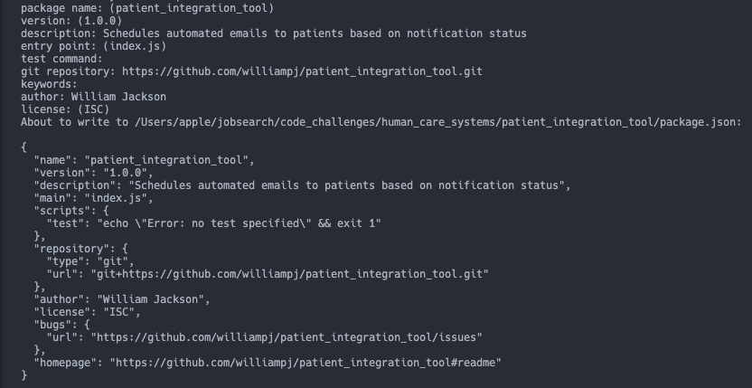
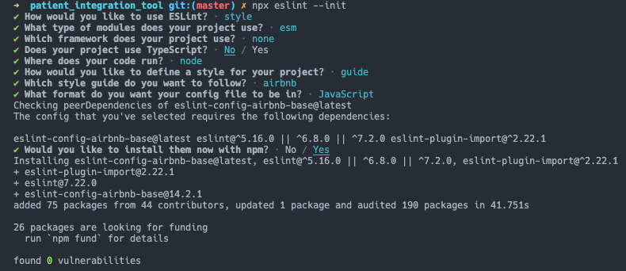

# Steps taken to build the program

### Project setup

1. Created the package.json file

`npm init`



2. Created a private repo for version control

`git init`

3. Set up eslint for style enforcement

`npm install eslint --save-dev`
`npx eslint --init`



4. Added `.gitignore` and `eslintignore` files and set them to ignore `node_modules`

5. Added all files and pushed the first commit to the private repo on github

6. Installed mongodb  
   ` npm install mongodb --save`

7. Installed csv-parse
   There are many CSV parsing tools, but I found `csv-parse` to be the simplest tool that nonetheless satisfies my user requirements.
   ` npm install csv-parse --save`

### Patient handler

8. Parsing the CSV file
   The first step was to read parse the CSV file and convert each line into a object for the database.

```js
const fs = require('fs');
const parse = require('csv-parse');
const url = 'mongodb://localhost:27017/';
const patientsFile = '../public/patients.csv';

const patients = [];

const parser = parse(
  { columns: true, separator: '|' },
  (err, records) => {
    if (err) reject(err);
    records.forEach((record) => {
      const re = /\|/;
      const columnHeaders = Object.keys(record)[0].split(re);
      const values = Object.values(record)[0].split(re);
      const patient = {};
      columnHeaders.forEach((columnHeader, index) => {
        patient[columnHeader] = values[index];
      });
      patients.push(patient);
    });
  }
);

fs.createReadStream(patientsFile).pipe(parser);
```

One of the advantages of the `csv-parse` tool is that it accepts a settings object whereby the `separator` argument (set to `,` by default) can be set to `|` since pipes are used instead of commas in the CSV data. Since each record in the records consists of a key-value pair where the key are pipe-separated heading and the value are pipe-separated values, I used some logic to convert each record into an object and push it into a `patients` array.
The problem with the current code is that code execution will continue past this snippet before the CSV file are piped to the parser and pushed to the `patients` array.

9. Promisifying the parsing of the CSV file and inserting into database
   Using promises and `async-await` syntax, I was able to resolve the `patients` so that I had all patients in the correct format for database insertion.

```js
const fs = require('fs');
const parse = require('csv-parse');
const { MongoClient } = require('mongodb');

// Default port for locally hosted MongoDB
const url = 'mongodb://localhost:27017/';
const patientsFile = '../public/patients.csv';

function parseCSV() {
  return new Promise((resolve, reject) => {
    const patients = [];

    const parser = parse(
      { columns: true, separator: '|' },
      (err, records) => {
        if (err) reject(err);
        records.forEach((record) => {
          const re = /\|/;
          const columnHeaders = Object.keys(record)[0].split(re);
          const values = Object.values(record)[0].split(re);

          const patient = {};
          columnHeaders.forEach((columnHeader, index) => {
            patient[columnHeader] = values[index];
          });
          patients.push(patient);
        });
      }
    );

    fs.createReadStream(patientsFile)
      .pipe(parser)
      .on('end', () => resolve(patients));
  });
}

async function main() {
  let client;
  try {
    client = await MongoClient.connect(url, {
      useUnifiedTopology: true
    });
    // Create patientsDatabase
    const patientsDatabase = client.db('patientsDatabase');
    // Awaits until all patients entries are parsed before proceeding with the database logic
    const patients = await parseCSV();
    // Each mongoDB insertion returns a promise that resolves to its result object, so the following line waits for all promises (insertions) to resolve before proceeding to close the database
    await Promise.all(
      patients.map((patient) =>
        patientsDatabase.collection('patients').insertOne(patient)
      )
    );
  } catch (e) {
    console.log(e);
  } finally {
    client.close();
  }
}

main();
```

10. I then refactored the functionality so far into a `DatabaseLoader` class in order to encapsulate the logic and to ease unit testing. It could also be easily extended and reused with a different database path, file path, database name and collection name. I keep the separator hardcoded to a pip `|` though this could be made dynamic as well.

```js
class DatabaseLoader {
  constructor({ url, filePath, dbName, collectionName }) {
    this.url = url;
    this.filePath = filePath;
    this.dbName = dbName;
    this.collectionName = collectionName;
  }

  loadDatabase() {
    const parseCSV = () =>
      new Promise((resolve, reject) => {
        const entries = [];

        const parser = parse(
          { columns: true, separator: '|' },
          (err, records) => {
            if (err) reject(err);

            records.forEach((record) => {
              const re = /\|/;
              const columnHeaders = Object.keys(record)[0].split(re);
              const values = Object.values(record)[0].split(re);
              const entry = {};
              columnHeaders.forEach((columnHeader, index) => {
                entry[columnHeader] = values[index];
              });
              entries.push(entry);
            });
          }
        );

        fs.createReadStream(this.filePath)
          .pipe(parser)
          .on('end', () => resolve(entries));
      });

    const loader = async () => {
      let client;
      try {
        client = await MongoClient.connect(this.url, {
          useUnifiedTopology: true
        });
        const db = client.db(this.dbName);
        const entries = await parseCSV();
        const result = await db
          .collection(this.collectionName)
          .insertMany(entries);
        console.log(
          `${result.insertedCount} patient entries were inserted in the Patients collection`
        );
      } catch (e) {
        console.log(e);
      } finally {
        await client.close();
      }
    };
    loader();
  }
}

module.exports = DatabaseLoader;
```

### Email handler

11. I researched jobs schedulers and email plugins and landed on `node-schedule` and `nodemailer` as adequate tools for the job.

`install node-schedule nodemailer --save`

12. I built out the email scheduler as a class from the get-go. The constructor takes collection name of `Patients` as argument in order to query patients for email consent. The database is still the `patientsDatabase`.

13. The first part is to retrieve patients consenting to emails. The `getPatientsWIthEmailConsent` function returns an array with patients with `CONSENT` set to `Y` and with valid email addresses. For the sole consenting patient without an email address, I assume that this is a job for HR to gather and insert into the database before emails could be scheduled for this person.

As I'm still making asynchronous method calls, I return promises.

```js
const getPatientsWithEmailConsent = (db) =>
  new Promise((resolve, reject) => {
    const EMAIL_REGEX = /^[a-zA-Z0-9.!#$%&'*+/=?^_`{|}~-]+@[a-zA-Z0-9-]+(?:\.[a-zA-Z0-9-]+)*$/;
    try {
      const consentingPatients = db
        .collection(this.collectionName)
        .find({
          CONSENT: 'Y',
          'Email Address': { $regex: EMAIL_REGEX }
        });
      resolve(consentingPatients.toArray());
    } catch (e) {
      reject(e);
    }
  });
```

14. The next part was building the email objects for the email scheduling and to insert into the `Emails` collection in the database.
    To schedule the date, I add the number of milliseconds in a day to the current time in order to add 24 hours to the scheduled date for each email.
    Using a nested loop, I then iterate the `patients` passed to the function, and assign the four pre-programmed emails to each by adding the patient's email address to the email object.
    The function resolves to the list of email objects.

```js
const buildEmailObjects = (patients) =>
  new Promise((resolve, reject) => {
    const MS_PER_DAY = 24 * 60 * 60 * 1000;
    const individualSchedule = () => {
      const dateNow = Date.now();
      const scheduledEmails = [
        { Name: 'Day 1', scheduled_date: dateNow + MS_PER_DAY },
        { Name: 'Day 2', scheduled_date: dateNow + MS_PER_DAY * 2 },
        { Name: 'Day 3', scheduled_date: dateNow + MS_PER_DAY * 3 },
        { Name: 'Day 4', scheduled_date: dateNow + MS_PER_DAY * 4 }
      ];
      return scheduledEmails;
    };

    const emailObjects = [];
    try {
      patients.forEach((patient) => {
        individualSchedule().forEach((scheduledEmail) => {
          const emailWithAddress = Object.assign(scheduledEmail, {
            'Email Address': patient['Email Address']
          });
          emailObjects.push(emailWithAddress);
        });
      });
      resolve(emailObjects);
    } catch (e) {
      reject(e);
    }
  });
```

15. Then I scheduled the jobs using the `nodemailer` and `node-schedule` libraries. I hardcoded the `transporter` options and the `mailOptions` of the emails but am adding the `to` field based on the address for each email.
    There are four email objects for each consenting patient, 28 in total. Future jobs are thus scheduled, based on the scheduled_date of each email object, whereby the email will be sent off using nodeMailer.

```js
const scheduleJobs = async (emailObjects) =>
  new Promise((resolve, reject) => {
    // e-mail transport configuration
    const transporter = nodemailer.createTransport({
      host: 'smtp.humancare.com',
      port: 465,
      secure: true,
      pool: true,
      auth: {
        user: 'user',
        pass: 'secret'
      }
    });
    // e-mail message options. Add 'to' field for each email
    const mailOptions = {
      from: 'humancare@humancaresystems.com',
      subject: 'Follow up from Human Care Systems',
      text: 'Remember to take your medicine'
    };

    try {
      emailObjects.forEach((email) => {
        const date = new Date(email.scheduled_date);
        const individualMailOptions = {
          ...mailOptions,
          to: email['Email Address']
        };
        nodeSchedule.scheduleJob(date, () => {
          transporter.sendMail(
            individualMailOptions,
            (error, info) => {
              if (error) {
                console.log(error);
              } else {
                console.log(
                  `${email.Name} email sent to ${email['Email Address']}: ${info.response}`
                );
              }
            }
          );
        });
      });
      resolve(emailObjects);
    } catch (e) {
      reject(e);
    }
  });
```

16. The last part of the email scheduling functionality is to insert the emails into the database and orchestrate the different tasks.
    Since each asynchronous task relies on the previous one being resolved, the asynchronous `schedule` function takes the form of successive `await` calls.
    Once the emails are bulk inserted, I log the result to the console and finally close the database.

```js
const schedule = async () => {
  let client;
  try {
    client = await MongoClient.connect(this.url, {
      useUnifiedTopology: true
    });
    const db = client.db(this.dbName);
    const patients = await getPatientsWithEmailConsent(db);
    let emails = await buildEmailObjects(patients);
    emails = await scheduleJobs(emails);
    const result = await db.collection('Emails').insertMany(emails);
    console.log(
      `${result.insertedCount} emails were inserted in the Emails collection`
    );
  } catch (e) {
    console.log(e);
  } finally {
    await client.close();
  }
};

schedule();
```

17. After running the `DatabaseLoader` and `EmailScheduler` within their files, I can now import them into a main `index.mjs` file which will orchestrate the program.

```js
import EmailScheduler from './email_scheduler.js';
import DatabaseLoader from './database_loader.js';

// Default port for locally hosted MongoDB
const url = 'mongodb://localhost:27017/';
const filePath = '../public/patients.csv';
const dbName = 'patientsDatabase';
const collectionName = 'Patients';

async function main() {
  try {
    // Load all patients into the Patients collection
    await new DatabaseLoader({
      url,
      filePath,
      dbName,
      collectionName
    }).loadDatabase();
    // Slight timeout ensures all patients are loaded before querying them for email preferences
    await new EmailScheduler({
      url,
      dbName,
      collectionName
    }).scheduleEmails();
  } catch (e) {
    console.log(e);
  }
}

// main();
main().catch(console.dir);
```

### Refactor and test

18. Refactoring
    I decided to improve the naming by reassigning the `DatabaseLoader` to `PatientHandler` and `EmailScheduler` to `EmailHandler` to better reflect the generic nature of the two classes while methods within the classes can retain names referring to their specific functionality. I also broke the `csv-parser`, `email_scheduler` (node-schedule + nodemailer) functionality into separate modules and moved them to a `utils` folder.
    I also cleaned up the code some in both the `PatientHandler` and `EmailHandler`.

19. Testing.
    Upon some cursory research, I settled on `Jest` as a testing framework as it's a popular JavaScript testing framework for NodeJS as well as React.

`npm install jest --save-dev`
`npm install @shelf/jest-mongodb --dev`

I add `jest` to a testing script and added the `start` script to run the program from the command line as well.

```json
  "scripts": {
    "start": "node src/index.mjs",
    "test": "jest"
  }
```

The testing suite creates its own database - `patientsDatabaseTest` - before all tests and tears them down again. I divided the testing suite into two files so that the `EmailHandler` and `PatientHandler` can be tested separately. This encapsulation comes at the cost of added testing time, as the test time is approximately 3.5 seconds.
Since the `EmailHandler` tests relies on the functionality of the `PatientHandler`, it serves to a degree as an end-to-end testing suite.

The testing suite runs 5 tests that tests the two handlers.
It furthermore prints the member IDs of patients without disclosed first names as well as the member id of the patient that consented to emails but did not disclose an email address.

The testing files are `patients_handler.test.js` and `email_handler.test.js`

20. I lastly added a `reset` script.
    While the testing suite builds and tears down its own testing database, there was no easy way for the user to reset the database. I added a `reset` script to address this.
