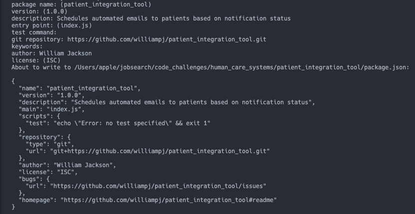
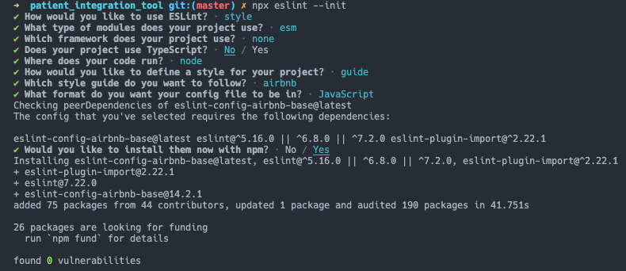

# Testing file

## Project setup

1. Created the package.json file

`npm init`

2. Created a private repo for version control

`git init`

3. Set up eslint for style enforcement

`npm install eslint --save-dev`
`npx eslint --init`

4. Added `.gitignore` file and set it to ignore `node_modules`
